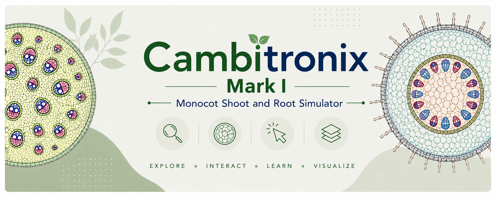

  

# 🌿 Cambitronix

**Interactive Plant Anatomy Simulator**

An interactive HTML-based educational simulator for exploring the internal anatomy of dicot stems and roots through realistic transverse sections, tissue systems, and microscope-inspired visualizations.

---

## ✨ Features

* **Interactive Anatomy:** Explore transverse sections (T.S.) of dicot stem and dicot root.
* **Tissue System Visualization:** Understand Dermal, Ground, and Vascular tissue systems through intuitive color coding.
* **Microscope-Inspired Graphics:** High-quality botanical illustrations designed to resemble textbook and laboratory observations.
* **Educational Learning:** Built following NCERT Biology concepts with emphasis on biological accuracy.
* **Interactive Interface:** Click, explore, and visualize plant tissues in an engaging browser-based environment.
* **Responsive Design:** Optimized for desktop, tablet, and mobile devices.

---

## 🌱 Learning Objectives

* Identify tissues in dicot stem and root.
* Compare stem and root anatomy.
* Understand the organization of tissue systems.
* Visualize xylem and phloem arrangement.
* Strengthen practical understanding of plant anatomy.

---

## 🚀 Build & Hosting

* **Repository:** GitHub
* **Hosting:** Github Pages
* **Frontend:** HTML, CSS & JavaScript

---

## 🛠️ Credits & Acknowledgments

* **Claude Sonnet 5.0** — Debugging, architecture, and implementation support.
* **OpenAI** — Base Image generation, Scientific validation, debugging, and logic refinement.

---

## 👤 Author

**Draven Ashcroft**

* M.Sc. Ag. Entomology
* ASRB NET
* DIPS Chain of Institutions

---

## 📜 License
